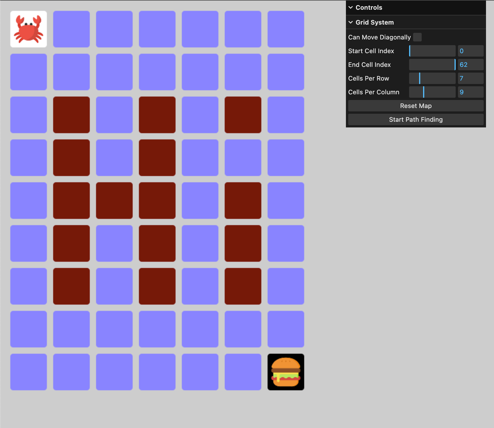

# dkb-AstarWithPixiJS

This is an interactive tool built using PixiJs and JavaScript to implement the A* Path Finding algorithm, offering adjustable elements such as grid size, start point, and end point.

## Boilerplate Overview

When run, it displays a 9x7 grid with the first cell as the start point and the last cell as the end point.

You can toggle the validity of cells by left-clicking on them, and to set the start and end points, you can adjust the values from the `Debug panel`, which was added using `lil-gui`.

To toggle the visibility of the debug panel, simply add `#debug` to the end of the URL and refresh the page

E.g.,
<br>
``` bash
http://localhost:3000/#debug
```

[Website Link](https://dkbozkurt.github.io/dkb-AstarWithPixiJS/)



## Installing

```bash
git clone https://github.com/dkbozkurt/dkb-AstarWithPixiJS.git
cd dkb-AstarWithPixiJS
npm install
```

### Develop

```
npm run dev
```

Visit [http://localhost:3000/#debug](http://localhost:3000/#debug)

### Build Production

```bash
npm run build
npm run preview
```

Visit [http://localhost:4173/#debug](http://localhost:4173/#debug)

### Deploy to GitHub pages

If you forked this repository, then you can publish your changes to GitHub pages.

```bash
npm run deploy
```

Visit `https://<your github username>.github.io/dkb-AstarWithPixiJS/#debug`

E.g.,

[https://dkbozkurt.github.io/dkb-AstarWithPixiJS/](https://dkbozkurt.github.io/dkb-AstarWithPixiJS/)